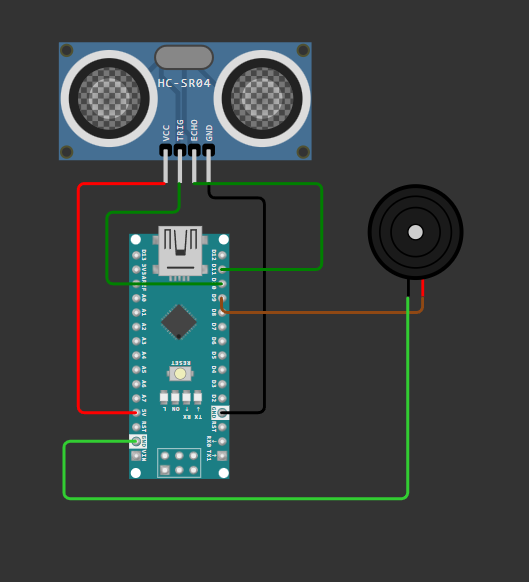

# Ultrasonic Blind Glass

An Arduino-based assistive project that uses an **HC-SR04 ultrasonic sensor** to detect objects in front of the user. When an object is detected within **20 cm**, a buzzer is activated to provide an alert.

## Components Used

* Arduino Nano
* HC-SR04 Ultrasonic Sensor
* Buzzer
* Jumper wires

## Circuit



### Pin Connections

| Component    | Arduino Nano Pin |
| ------------ | ---------------: |
| Buzzer       |               D9 |
| HC-SR04 Trig |              D10 |
| HC-SR04 Echo |              D11 |

---

## Code

```cpp
float duration, distance;

void setup() {
  pinMode(9, OUTPUT);  // Buzzer pin
  pinMode(10, OUTPUT); // Trig pin
  pinMode(11, INPUT);  // Echo pin
  Serial.begin(9600);
}

void loop() {
  digitalWrite(10, LOW);
  delayMicroseconds(2);

  digitalWrite(10, HIGH);
  delayMicroseconds(10);
  digitalWrite(10, LOW);

  duration = pulseIn(11, HIGH);
  distance = duration * 0.034 / 2;

  Serial.println(distance);
  delay(500);

  if (distance <= 20) {
    digitalWrite(9, HIGH);
  }
  else {
    digitalWrite(9, LOW);
  }
}
```

---

## Code Explanation

### Trigger Pulse

```cpp
digitalWrite(10, LOW);
delayMicroseconds(2);

digitalWrite(10, HIGH);
delayMicroseconds(10);
digitalWrite(10, LOW);
```

The HC-SR04 starts a measurement when its **Trig pin receives a HIGH pulse of at least 10 microseconds**. The Arduino sends this short pulse through pin D10, causing the sensor to transmit an ultrasonic burst.

### `delayMicroseconds()`

```cpp
delayMicroseconds(10);
```

This creates a very short delay measured in microseconds, which is necessary for generating the precise trigger pulse required by the HC-SR04. `delay()` is measured in milliseconds, so `delayMicroseconds()` is used here because the trigger pulse needs to be extremely short.

### `pulseIn()`

```cpp
duration = pulseIn(11, HIGH);
```

`pulseIn()` measures how long the Echo pin remains HIGH and returns the time in microseconds. The HC-SR04 keeps its Echo signal HIGH for the time it takes the ultrasonic wave to travel to the object and return.

### Distance Calculation

```cpp
distance = duration * 0.034 / 2;
```

The speed of sound is approximately **0.034 cm/µs**, so the echo time is multiplied by this value. The result is divided by `2` because the measured time represents the ultrasonic wave's **round trip** from the sensor to the object and back.

### `Serial.println()`

```cpp
Serial.println(distance);
```

This prints the calculated distance to the Serial Monitor, which is useful for testing and debugging the sensor.

### Distance Detection

```cpp
if (distance <= 20) {
  digitalWrite(9, HIGH);
}
else {
  digitalWrite(9, LOW);
}
```

The program checks whether the detected object is **20 cm or closer**. If it is, the buzzer connected to D9 is turned ON; otherwise, it is turned OFF.

---

## How It Works

1. Arduino Nano sends a **10 µs trigger pulse** to the HC-SR04.
2. HC-SR04 sends an ultrasonic wave toward the object.
3. The wave reflects from the object and returns to the sensor.
4. The Echo pin stays HIGH for the duration of the round trip.
5. `pulseIn()` measures this duration.
6. Arduino calculates the distance using the echo time.
7. If the distance is **≤ 20 cm**, the buzzer turns ON.
8. Otherwise, the buzzer remains OFF.

## Distance Formula

```text
Distance = (Echo Time × Speed of Sound) / 2
```

For this project:

```text
Distance (cm) = Duration (µs) × 0.034 / 2
```
